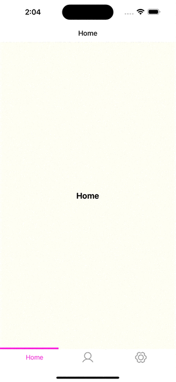

# Shared Element Transition
Shared Element Transition with React Native, React Navigation and Reanimated V3.

## Demo

## Tech Stack

- React
- React Native
- Typescript
- React Navigation v6
- Reanimated v3

## Authors

- [@PHTorres](https://www.github.com/phtorres)

## 🚀 About Me
- I’m currently working on <a href="https://www.codelitt.com/" target="_blank"> Codelitt</a> Mobile Apps;
- I’m currently learning Swift for IOS native apps;
- I’m looking to collaborate on React or React Native products;
- Ask me about React Native, React, .NET, C# and TypeScript;

